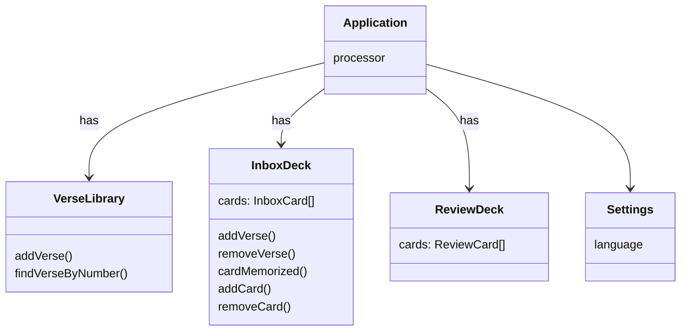

# Application Architecture

```mermaid
classDiagram

Application --> VerseLibrary : has
Application --> InboxDeck : has
Application --> ReviewDeck : has
Application --> Settings

class Application {
  processor
}

class VerseLibrary {
  addVerse()
  findVerseByNumber()
}

class InboxDeck {
  cards: InboxCard[]
  addVerse()
  removeVerse()
  cardMemorized()
  addCard()
  removeCard()
}

class ReviewDeck {
  cards: ReviewCard[]
}

class Settings {
  language
}
```